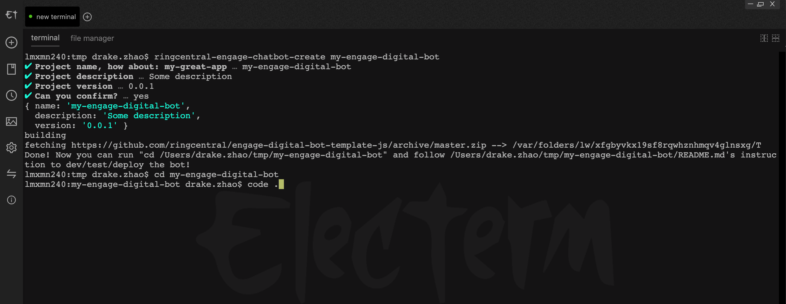

# Engage Digital Chatbot Framework for JavaScript

[](https://travis-ci.org/ringcentral/engage-digital-chatbot-js)

[RingCentral Engage (Dimelo)](https://www.dimelo.com/en/dimelo-digital) bot framework for JavaScript

* [API docs](https://developers.ringcentral.com/engage/digital/guide).

## Prerequisites

- Nodejs 8.10+/npm, recommend using [nvm](https://github.com/creationix/nvm) to install nodejs/npm.
- RingCentral Engage(Dimelo) account, [request a demo](http://site.dimelo.com/en/demo#schedule-demo).

## Quick start

Let's start a simple RingCentral Engage chatbot server that will auto respond to any email with a auto reply.

```bash
# get the code
git clone git@github.com:ringcentral/engage-digital-chatbot-js.git
cd engage-digital-chatbot-js

# install dependecies
npm i

# start proxy server, this will make your local bot server can be accessed by RingCentral service
npm run ngrok

# will show
Forwarding                    https://xxxx.ap.ngrok.io -> localhost:6066
# Remember the https://xxxx.ap.ngrok.io, we will use it later
```

Follow [Step by Step guide to enable sources](docs/guides-to-add-sources.md) to prepare the source and webhook. You could choose only one source.

```bash
# create env file
cp .env.sample .env
# then edit .env, set proper setting according to the tip in .env

# run local dev server
npm start
```

### Test bot

- Send a email to your predefined email source address, then bot will auto reply with `This is a auto reply by bot`.
- Edit `example-bots/auto-reply-all.js` to set your own reply logic.

### Test bot skill

- Run `npm run dev1` to run bot with skills
- Check `example-bots/auto-reply-all-with-skills.js` and `example-skills/ping-pong-skill.js`

## Youtube video

[https://youtu.be/HDDGUFIzNxQ](https://youtu.be/HDDGUFIzNxQ)

## Use it as CLI tool

```bash
npx ringcentral-engage-chatbot path-to-your-bot.js
```

## Use is as a module

Check [docs/direct-use.md](docs/direct-use.md)

## Real example

- [https://github.com/zxdong262/ping-pong-engage-digital-chatbot](https://github.com/zxdong262/ping-pong-engage-digital-chatbot): Example engage digital chat bot that will respond with "pong" for "ping" message.

## Write a bot

[docs/write-a-bot.md](docs/write-a-bot.md)

## Write a bot skill

[docs/write-use-a-skill.md](docs/write-use-a-skill.md)

## Build and Deploy to AWS Lambda

[deploy-to-lambda.md](docs/deploy-to-lambda.md)

## Init a bot/bot skill project with factory CLI tool

We have built-in CLI command to init a empty project from template: [https://github.com/ringcentral/engage-digital-bot-template-js](https://github.com/ringcentral/engage-digital-bot-template-js).

```bash
npm i -g ringcentral-engage-chatbot
ringcentral-engage-chatbot-create my-app
```

Will show:



## License

MIT
